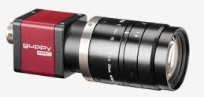
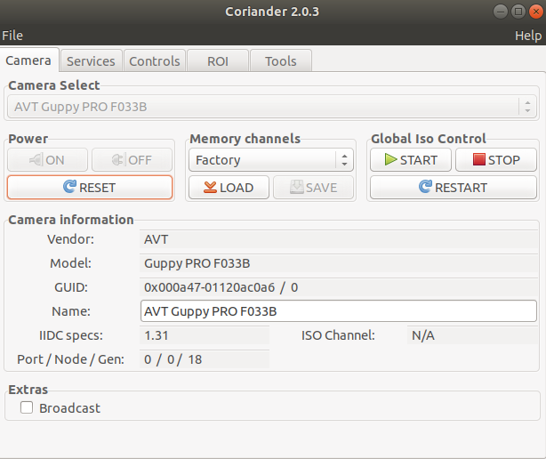

# Table of Contents

1. [Lab experiment](#realenv)
	1. [Setting up the camera](#cameraset)
	2. [Camera calibration](#calibration)
	3. [Using the ROS package](#ros)
2. [Simulated environement](#simuenv)
	1. [Simulation with CoppeliaSim](#coppsim)
	2. [Control Panda with a Xbox controller](#xboxpanda)
	3. [Control Panda using b0RemoteApi](#b0RemoteApi)
	4. [Putting everything together: Hybrid Force/Vision control for Panda using ViSP](#pandapbvs)

# Lab experiment 

## Setting up the camera 

In this project we use the AVT Guppy PRO F033b camera. 

It's a FireWire CCD camera, FireWire cameras use the IEEE1394 bus standard for transmission. You can find more details at https://www.alliedvision.com/en/products/cameras/detail/Guppy%20PRO/F-033.html.

If you want a quick way to test if the camera is working properly on Linux (I'm using Ubuntu 18.04.3), I recommend using Coriander, which is a GUI for IEEE1394 cameras.

To install Coriander, you need to install these dependencies first:

1. libraw1394 https://sourceforge.net/projects/libraw1394/
2. libdc1394 https://sourceforge.net/projects/libdc1394/
3. SDL 1.2.15 https://libsdl.org/download-1.2.php
If you get this error while building SDL
> ./src/video/x11/SDL\_x11sym.h:168:17: error: conflicting types for ‘\_XData32’
 SDL\_X11\_SYM(int,\_XData32,(Display \*dpy,register long \*data,unsigned len),(dpy,data,len),return)

You can fix it by typing the following command in terminal
>sed -i '/\_XData32/d' src/video/x11/SDL\_x11sym.h

Finally you can install Coriander:

Download here https://sourceforge.net/projects/coriander/ and install Coriander.
Ifhttp://www.tldp.org/HOWTO/libdc1394-HOWTO/index.html you get this error while building
> thread\_save.c:859:12: error: ‘SAVE\_FORMAT\_TIFF’ undeclared (first use in this function); did you mean ‘SAVE\_FORMAT\_PVN’?
       case SAVE\_FORMAT\_TIFF:

You need to install libtiff4 and libtiff4-dev. You can do so by following this tutorial https://tutorialforlinux.com/2018/10/10/how-to-install-libtiff4-libtiff4-dev-for-ubuntu-18-04-bionicl-gnulinux-easy-guide/3/

After installing, just type coriander in the terminal. If everything went well you should see your camera information, display the camera stream and change the camera settings.

You can play with the settings (gain, brightness, shutter...) in the controls tab. I found that for my testing purposes settings both gain and shutter to auto was fine.

## Camera calibration 
You can check the camera\_calibration folder to see how to quickly calibrate a FireWire camera. 
It uses ViSP for image acquisition and calibration.

You need to have your camera wired to the computer for this step.

First, you need to build the visp\_acquire\_calib\_data program.  Launch the program and start acquiring photograph by clicking on the ViSP camera feedback window.

After you're done with data acquisition, build the visp\_calibrate\_camera program. In the visp\_calibrate\_camera\_data folder, you'll find a file named my-chessboard.cfg.
You'll need to modify this file by setting the correct information according to your checkerboard (square size, width ,height). 

Copy the photograph data to the visp\_calibrate\_camera\_data folder. Finally, you can launch the calibrate\_camera program.
After it's done, you'll find the camera intrinsics parameters in camera.xml.

## Using the ROS package 

To use this ROS package, you'll need to use franka_ros. If you want to use the hybrid control laws you'll need to implement a teleoperation or comanipulation control law. 
If you just want to use PBVS, you can use the package as it is and send velocities to the Panda using franka_ros.

Click on the image below to check out the result using teleoperation in a hybrid parallel control law. 

# Simulated environement 

## Simulation with CoppeliaSim 

[CoppeliaSim](https://www.coppeliarobotics.com/) is a fork of the V-REP Project. I chose to use this simulation environment because there was already a model of the Franka Panda included. The model is a result of this paper ["Dynamic Identification of the Franka Emika PandaRobot With Retrieval of Feasible Parameters UsingPenalty-Based Optimization"](https://hal.inria.fr/hal-02265293/document) by C.Gaz, M.Cognetti, A. Oliva, P. Robuffo Giordano and A. De Luca, 2019.

Also there is a C++ API which makes it easy to bridge with OpenCV and ViSP.

To learn to use the API, follow these two tutorials https://www.coppeliarobotics.com/helpFiles/en/b0RemoteApiClientSide.htm, https://www.coppeliarobotics.com/helpFiles/en/b0RemoteApiServerSide.htm.

## Control Panda with a Xbox controller (WINDOWS ONLY)  

If you want use a Xbox controller in CoppeliaSim, you need to create a plugin. In https://github.com/StephaneSobucki/CoppeliaSimExtensionXbox360Controller I explain how to do so. The pre-compiled dll is also available in the same repo.
Click on the image below to see an example in video.

In the video each joint are actuated by the xbox controller input. I included the scene from the video in examples/coppeliasim\_xbox\_panda\_control/

## Control Panda using b0RemoteApi 

We use the [b0RemoteApi](https://www.coppeliarobotics.com/helpFiles/en/b0RemoteApiOverview.htm) to control the Panda.
Basically it's a client-server approach, where the server is the simulated environment, in which we can write Lua or C++ scripts, and the client is our application (in C++, Java, Python or Matlab). The client send the target joint velocity to the server. In the simulation, the motors then apply the necessary torque to achieve the desired velocity for each respective joints.
On the server side (in coppelia), you have access to the robot dynamics and kinematics. OMPL (Open Motion Planning Library) is also available. The coppelia API documentation can be found here https://www.coppeliarobotics.com/helpFiles/en/apiOverview.htm. 

## Putting everything together: Hybrid Force/Vision control for Panda 

Now we have all the building blocks to implement control laws for the Panda, in the CoppeliaSim environment.

I built a scene to implement and test hybrid force/vision control laws, in which you have the panda robot with an eye-in-hand setup (camera mounted on the end effector) and an AprilTag. We get the pose of the AprilTag in the camera frame using ViSP. 
The program developped for CoppeliaSim using BlueZero can be found in panda_servo_coppeliasim/ 

You'll need to install ViSP https://visp.inria.fr/download/ first.

You can check out the result in a video by clicking on the image below:

